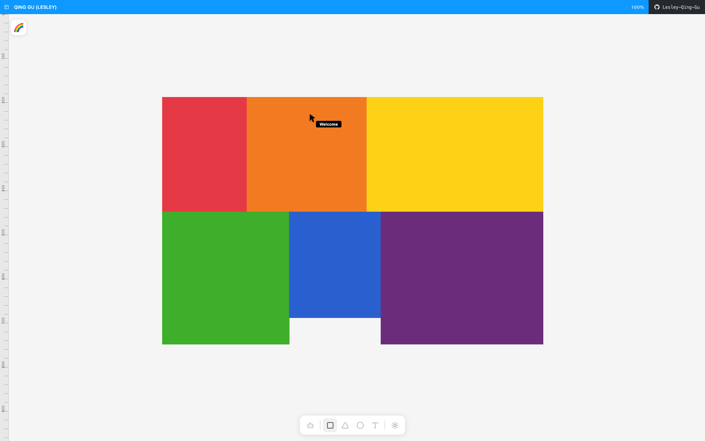

# Lesley Gu — Portfolio

**[lesley-qing-gu.github.io](https://lesley-qing-gu.github.io/)**

I'm Qing Gu (Lesley), a UX Engineer and Creative Technologist. I engineer AI-forward, accessible systems that resonate across diverse human experiences — blending a filmmaker's storytelling with a dancer's heightened sensitivity to make sure the future of tech is not just smart, but fundamentally human-centric.

This site is my portfolio, organized into six colored blocks you can click into:

- **Web Design & Dev** — full-stack apps and AI-powered tools, from a computer-vision climbing logbook to interactive film-data visualizations
- **UX/UI Design** — research-driven product and interface design, including work from my HCI master's at KTH & Aalto and my time at Ericsson
- **Product Design** — physical and hardware-adjacent product work, from an AI sleep-aid pillow to a moisture-reactive bamboo rain shelter
- **Graphic Design** — posters, brand identities, and book design for film screenings, reading seminars, and community events
- **Research** — HCI and psychology research on accessibility, working memory, and cross-cultural emotion
- **About & Contact** — who I am, beyond the work

Each block expands into a full case study with the story behind it, screenshots, videos, and live demos where available.
